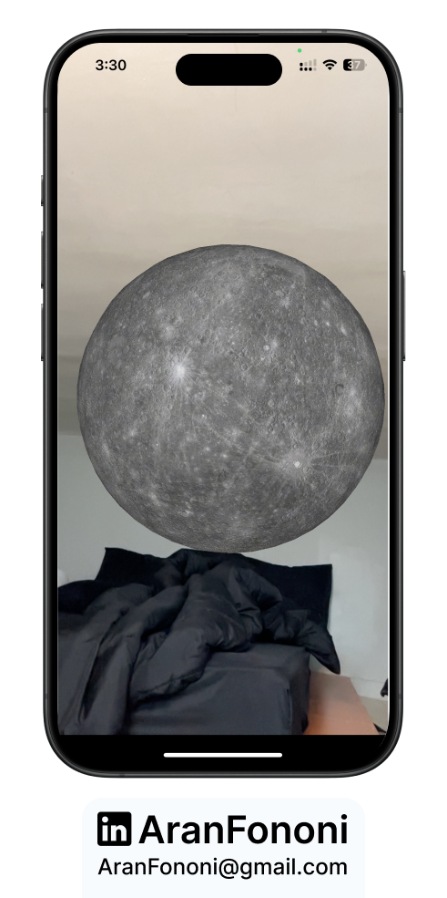
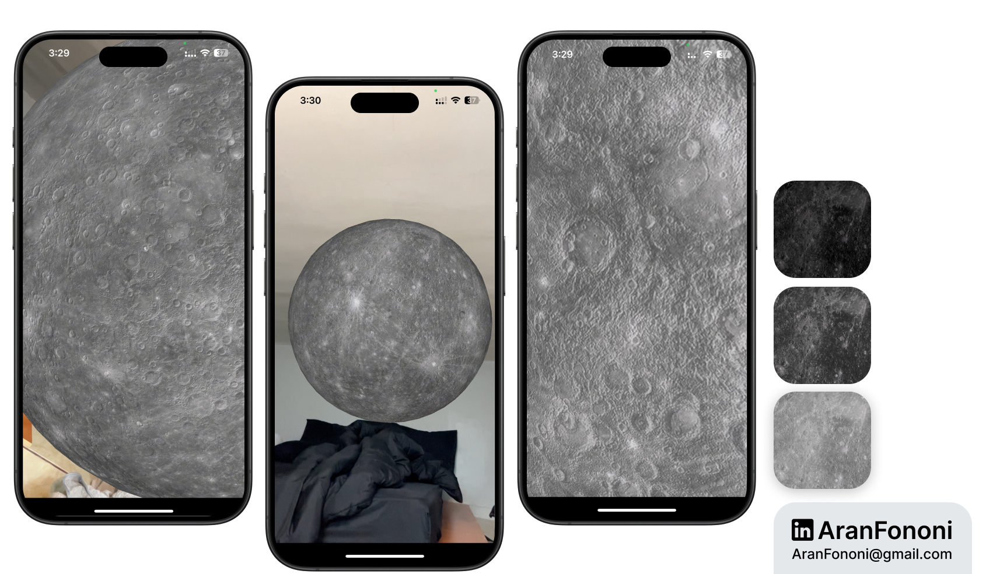

# MyMoon 🌌

### Personal AR Project: **3D Lunar Simulation in Augmented Reality**

**MyMoon** is a personal AR project where a realistic, high-resolution 3D model of the moon is displayed in augmented reality. Created outside the course scope, this app was developed as a self-challenge to expand on AR concepts introduced in the Angela Yu course. MyMoon offers an immersive view of the moon, displayed in real-time with interactive lighting.

## Project Overview
MyMoon uses **ARKit** and **SceneKit** to render a highly detailed 3D model of the moon (using an 8K texture image of Mercury) within an AR environment. Users can view a realistic model as if placed in their real-world space, with auto-enabled lighting for enhanced realism.

## What I Learned
This self-driven project expanded my ARKit skills with:
- **3D Model Creation**: Designing and implementing a realistic 3D sphere with high-resolution textures.
- **Texture Mapping**: Applying 8K resolution textures to create realistic surface detail on a 3D object.
- **Lighting and Shadow Management**: Experimenting with SceneKit’s lighting properties to bring out textures and shadows dynamically.

## Key Skills
- SceneKit 3D modeling and texture mapping
- ARKit configuration for immersive object placement
- Managing realistic lighting for a natural effect in AR

## Additional Features
- **8K Texture Mapping**: Ultra-high-definition texture of the moon’s surface for an immersive experience.
- **Automatic Lighting Adjustments**: SceneKit’s lighting auto-adjustments enhance texture visibility and realism.

---

### Project Preview

---

### Footer

---

## Contact
For more information, feel free to reach out:  
- **Email**: [aranfononi@gmail.com](mailto:aranfononi@gmail.com)  
